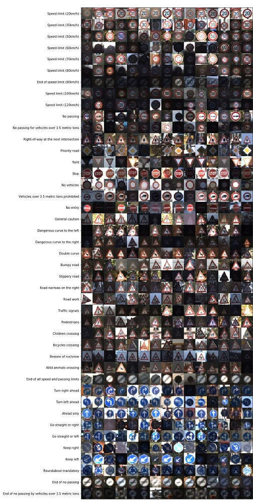
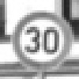
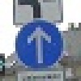

# **Traffic Sign Recognition**

## Writeup

### You can use this file as a template for your writeup if you want to submit it as a markdown file, but feel free to use some other method and submit a pdf if you prefer.

---

**Build a Traffic Sign Recognition Project**

The goals / steps of this project are the following:
* Load the data set (see below for links to the project data set)
* Explore, summarize and visualize the data set
* Design, train and test a model architecture
* Use the model to make predictions on new images
* Analyze the softmax probabilities of the new images
* Summarize the results with a written report

## Rubric Points
### Here I will consider the [rubric points](https://review.udacity.com/#!/rubrics/481/view) individually and describe how I addressed each point in my implementation.

---
### Writeup / README

#### 1. Provide a Writeup / README that includes all the rubric points and how you addressed each one. You can submit your writeup as markdown or pdf. You can use this template as a guide for writing the report. The submission includes the project code.

You're reading it! and here is a link to my [project code](https://github.com/eduidl/CarND-Traffic-Sign-Classifier-Project/blob/master/Traffic_Sign_Classifier.ipynb)

### Data Set Summary & Exploration

#### 1. Provide a basic summary of the data set. In the code, the analysis should be done using python, numpy and/or pandas methods rather than hardcoding results manually.

I used the pandas library to calculate summary statistics of the traffic
signs data set:

* The size of training set is 34799
  * 34799 (original)
  * 39799 (with augmentation)
* The size of the validation set is 4410
* The size of test set is 12630
* The shape of a traffic sign image is (32, 32, 3)
* The number of unique classes/labels in the data set is 43

#### 2. Include an exploratory visualization of the dataset.

Here is an exploratory visualization of the data set. It is a bar chart showing how the data ...



### Design and Test a Model Architecture

#### 1. Describe how you preprocessed the image data. What techniques were chosen and why did you choose these techniques? Consider including images showing the output of each preprocessing technique. Pre-processing refers to techniques such as converting to grayscale, normalization, etc. (OPTIONAL: As described in the "Stand Out Suggestions" part of the rubric, if you generated additional data for training, describe why you decided to generate additional data, how you generated the data, and provide example images of the additional data. Then describe the characteristics of the augmented training set like number of images in the set, number of images for each class, etc.)

##### Preprocess

I preprocessd the image data by 3 steps as follows.

- Grayscale
  - Traffic signs can be distinguished from each other in grayscale from human eyes. Conversion into grayscale may enhance the robustness to lighting environments or lead to avoid over fitting.

```py
def grayscale(img):
    return cv2.cvtColor(img, cv2.COLOR_RGB2GRAY)
```

- Histogram equalization
  - Shape and edge of traffic sign would be emphasized.

```py
def equalize_hist(img):
    return cv2.equalizeHist(img)
```

- Normalization
  - Generally, normalization has good effect to machine learning including deep learning.

```py
def normalize(img):
    min_, max_ = np.min(img), np.max(img)
    return (img - min_) / (max_ - min_) * 2 - 1
```

| Process                 | Image                              |
|:-----------------------:|:----------------------------------:|
| (Original)              | 
| Grayscale               | 
| Histogram Equailization | 
| Normalization           | 

##### Data Augmentation

I compared accuracy graph between training's and validation's, and I thought over fitting occured.
Therefore I decided to generate additional data. As a result, I used mixup only.

The following image is mixup example from `Speed limit (30km/h)` and `Children crossing`


```py
from tqdm import tqdm

alpha = 1.
augmented_X = []
augmented_y = []

for _ in tqdm(range(5000)):
    indexes = np.arange(n_train)
    np.random.shuffle(indexes)
    i, j = indexes[:2]
    lambda_ = np.random.beta(alpha, alpha)
    augmented_X.append(normalize(X_train[i] * lambda_ + X_train[j] * (1 - lambda_)))
    augmented_y.append(y_one_hot_train[i] * lambda_ + y_one_hot_train[j] * (1 - lambda_))
```

Indeed, I tried other some techniques as follows, however which did not well.
  - Rotation
  - Noise addition (Gaussian noise, Salt and pepper noise)
  - Parallel displacement
  - Scaling

I did not try ...
- Horizontal or vertical flipping
  - Direction of traffic sign is significant.
- Random cropping
  - I think that very significant part may be cropped and signs would be undistinguishable.

#### 2. Describe what your final model architecture looks like including model type, layers, layer sizes, connectivity, etc.) Consider including a diagram and/or table describing the final model.

My final model consisted of the following layers:

| Layer           | Description
|:---------------:|:-----------:
| Input           | 32x32x1 grayscale image
| Convolution 3x3 | 1x1 stride, `VALID` padding, batch normalization, outputs 28x28x6
| ReLU            |
| Max pooling     | 2x2 stride, outputs 14x14x6
| Convolution 3x3 | 1x1 stride, `VALID` padding, batch normalization, outputs 10x10x16
| ReLU            |
| Max pooling     | 2x2 stride, outputs 5x5x16         |
| Fully connected | inputs 400, batch normalization, outputs 120
| ReLU            |
| Dropout         | keep_prob=0.5
| Fully connected | inputs 120, batch normalization, outputs 84
| ReLU            |
| Dropout         | keep_prob=0.5
| Fully connected | inputs 84, batch normalization outputs 43
| Softmax         |

#### 3. Describe how you trained your model. The discussion can include the type of optimizer, the batch size, number of epochs and any hyperparameters such as learning rate.

To train the model, I used

- Optimizer: Adam
- Batch size: 128
- Learning rate: 0.03
- epochs = 50

#### 4. Describe the approach taken for finding a solution and getting the validation set accuracy to be at least 0.93. Include in the discussion the results on the training, validation and test sets and where in the code these were calculated. Your approach may have been an iterative process, in which case, outline the steps you took to get to the final solution and why you chose those steps. Perhaps your solution involved an already well known implementation or architecture. In this case, discuss why you think the architecture is suitable for the current problem.

My final model results were:
* training set accuracy of 0.971
* validation set accuracy of 0.975
* test set accuracy of 0.952

If an iterative approach was chosen:
* What was the first architecture that was tried and why was it chosen?
  * I tried LeNet-5 because I thought this was light model however sufficient complex model for classification of traffic sign. In tha kind of meaning, LeNet-5 is well-ballanced model.
* What were some problems with the initial architecture?
  * Validation Accuracy remained low comparing to training accuracy, which means over fitting occurred.
* How was the architecture adjusted and why was it adjusted? Typical adjustments could include choosing a different model architecture, adding or taking away layers (pooling, dropout, convolution, etc), using an activation function or changing the activation function. One common justification for adjusting an architecture would be due to overfitting or underfitting. A high accuracy on the training set but low accuracy on the validation set indicates over fitting; a low accuracy on both sets indicates under fitting.
  * For prevention of over fitting, I introduced two dropout layer and batch normalization.
* Which parameters were tuned? How were they adjusted and why?
  * I increased epoch size to improve accuracy.
  * Before using batch normalization, I lowered learning rate to 0.001 for prevention of under fitting. However, after using that, learger learning rate can be used.
* What are some of the important design choices and why were they chosen? For example, why might a convolution layer work well with this problem? How might a dropout layer help with creating a successful model?

### Test a Model on New Images

#### 1. Choose five German traffic signs found on the web and provide them in the report. For each image, discuss what quality or qualities might be difficult to classify.

Here are five German traffic signs that I found on the web:

|  |  |  |  | 
| Slippery road | Priority road | Speed limit (60km/h) | Ahead only | Road work

#### 2. Discuss the model's predictions on these new traffic signs and compare the results to predicting on the test set. At a minimum, discuss what the predictions were, the accuracy on these new predictions, and compare the accuracy to the accuracy on the test set (OPTIONAL: Discuss the results in more detail as described in the "Stand Out Suggestions" part of the rubric).

Here are the results of the prediction:

| Image                | Prediction            |
|:--------------------:|:---------------------:|
| Slippery road        | Wild animals crossing |
| Priority road        | Priority road         |
| Speed limit (60km/h) | Speed limit (60km/h)  |
| Ahead only           | Ahead only            |
| Road work            | Road work             |


The model was able to correctly guess 4 of the 5 traffic signs, which gives an accuracy of 80%. This compares favorably to the accuracy on the test set of 0.952

#### 3. Describe how certain the model is when predicting on each of the five new images by looking at the softmax probabilities for each prediction. Provide the top 5 softmax probabilities for each image along with the sign type of each probability. (OPTIONAL: as described in the "Stand Out Suggestions" part of the rubric, visualizations can also be provided such as bar charts)

The code for making predictions on my final model is located in the 19th cell of the Ipython notebook.

```py
with tf.Session() as sess:
    saver.restore(sess, tf.train.latest_checkpoint('.'))
    top_k_outputs = sess.run(tf.nn.top_k(tf.nn.softmax(logits), k=5),
                             feed_dict={x: test_images, keep_prob: 1.0, is_training: False})
```

For the first image, the model is relatively sure that this is a stop sign (probability of 0.6), and the image does contain a stop sign. The top five soft max probabilities were

| Probability | Prediction |
|:-----------:|:---------------------------------------------:|
| .24         | Wild animals crossing |
| .22         | General Caution           |
| .07         | Y            |
| .06         | Bumpy Road                   |
| .05         | Slippery Road                    |


For the second image ...
